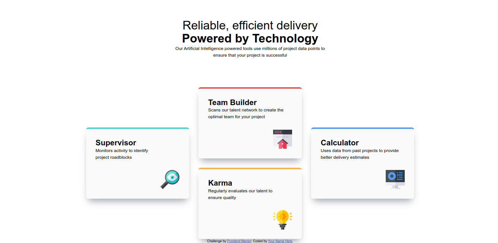

# Frontend Mentor - Four card feature section solution

This is a solution to the [Four card feature section challenge on Frontend Mentor](https://www.frontendmentor.io/challenges/four-card-feature-section-weK1eFYK). Frontend Mentor challenges help you improve your coding skills by building realistic projects.

## Table of contents

- [Overview](#overview)
  - [The challenge](#the-challenge)
  - [Screenshot](#screenshot)
  - [Links](#links)
- [My process](#my-process)
  - [Built with](#built-with)
  - [What I learned](#what-i-learned)
  - [Useful resources](#useful-resources)
- [Author](#author)

## Overview

### The challenge

Users should be able to:

- View the optimal layout for the site depending on their device's screen size

### Screenshot

### Links

- Solution URL: [solution URL here](https://your-solution-url.com)
- Live Site URL: [live site URL here](https://your-live-site-url.com)

## My process

### Built with

- Semantic HTML5 markup
- CSS custom properties
- Flexbox
- CSS Grid

### What I learned

I learned how to use block elements and learned how flexible is flexbox layout is.

### Useful resources
https://www.youtube.com/watch?v=JFbxl_VmIx0&t=515s
## Author

- Website - [Md. Rajin Mashrur Siam](https://rajin-siam.github.io/Portfolio/)
- Frontend Mentor - [@rajin-siam](https://www.frontendmentor.io/profile/yourusername)
- LinkedIn - [md-rajin-mashrur-siam](https://www.linkedin.com/in/md-rajin-mashrur-siam/)

